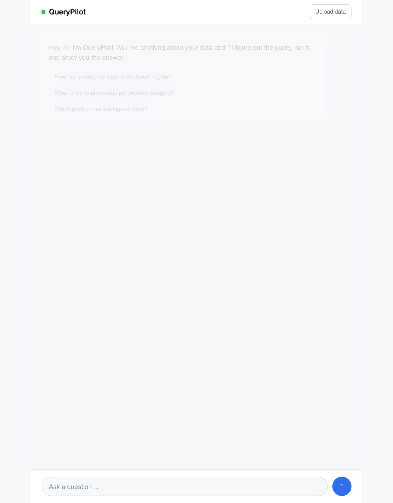
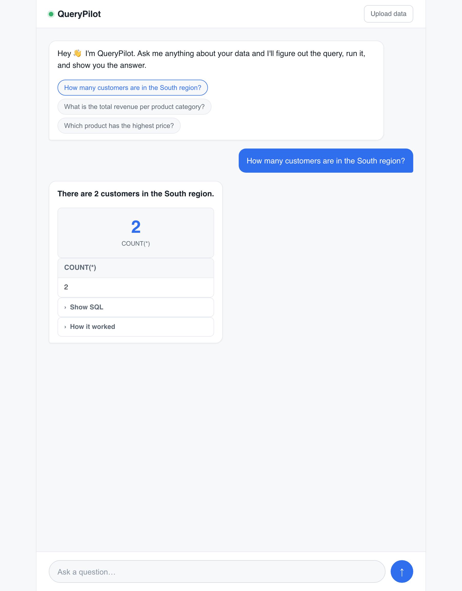
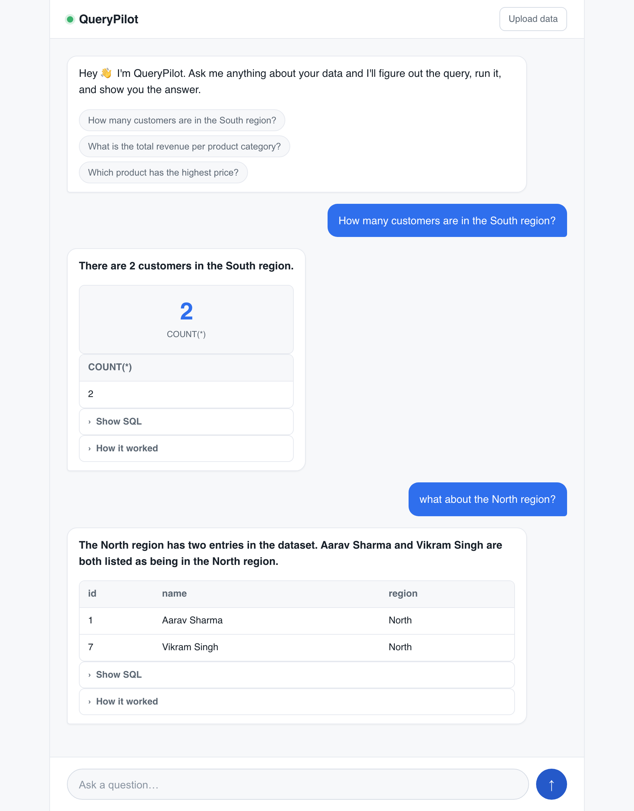
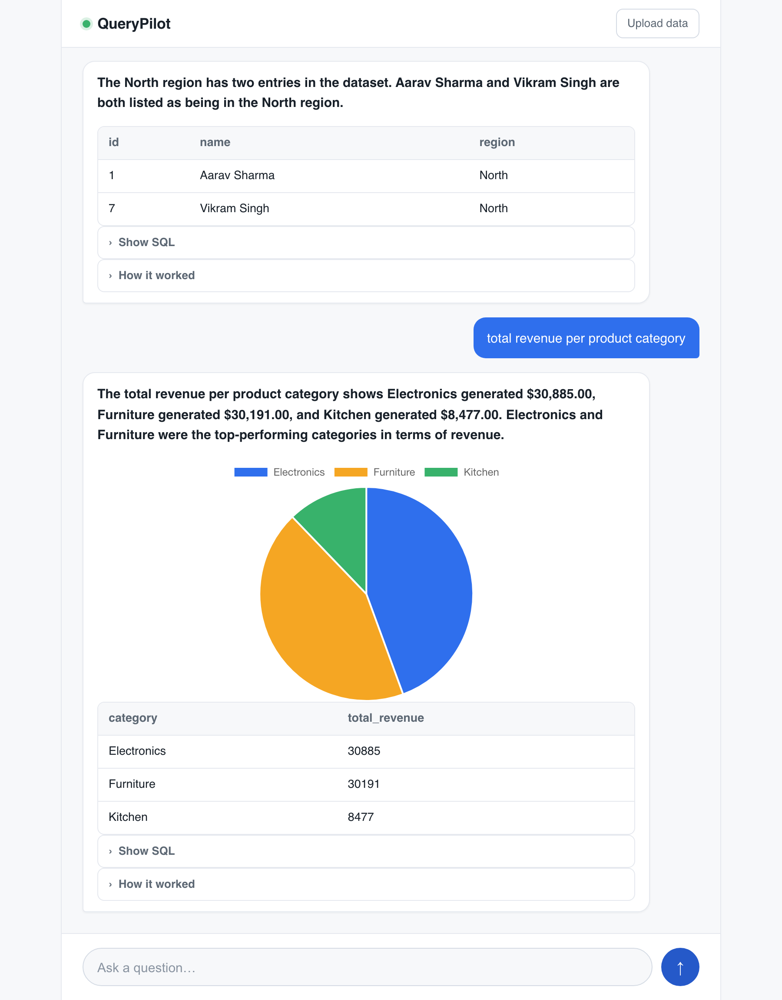

# QueryPilot

Ask questions about your data in plain English and get answers back. QueryPilot
turns the question into SQL, checks it is safe to run, runs it, and fixes its own
query if it fails.



## How it works

```
question -> write sql -> safety check -> run -> (error? retry) -> answer
```

- A local model (via Ollama) writes the SQL from your question.
- The query is checked to make sure it is read-only (only SELECT is allowed).
- If the query errors, the error is fed back to the model and it tries again.

## Screenshots

The web app is a chat. You ask a question, it replies, and it remembers the
earlier turns so follow-ups work.

Ask a question and get a plain-English answer with the data:



Follow-up questions use the previous message for context (here "what about the
North region?" after asking about the South):



When the result fits a chart, it draws one:



## Setup

```bash
python3 -m venv .venv
.venv/bin/pip install -r requirements.txt
```

You also need [Ollama](https://ollama.com) running with a coder model:

```bash
ollama pull qwen3-coder:30b
```

## Run it

Everything — database, agent, chart picker, and the FastAPI web backend —
lives in `querypilot.ipynb`. Open it and run all cells top to bottom:

```bash
.venv/bin/jupyter notebook querypilot.ipynb
```

The last cell starts the web server in the notebook itself. Then open
http://127.0.0.1:8000. The database starts empty — upload a CSV, Excel, or
SQLite file with the upload button (or click "Load demo data" to try it on a
small sample sales database) and then ask a question. You get a plain-English
answer, a chart, the data table, the SQL, and a short trace of what the agent
did.

## Use your own data

Drop a CSV, Excel, or `.db`/`.sqlite` file into the upload button in the web
app, or load a file straight from a notebook cell:

```python
load_file("sales.csv")   # becomes a table you can query
```

## Evaluation

There is a small test set of questions (`eval/testset.json`) with
known-correct SQL. The `run_eval()` cell near the bottom of the notebook runs
the agent on each and checks the results match.

Latest run: 18/18 correct (100%), 0 needed a retry. It bounces around a bit
run to run (the model isn't deterministic) - the one miss seen before was
"average order value" read as a median instead of a mean, a wrong reading of
the question rather than broken SQL, so self-correction doesn't help there.
On this data the model rarely writes broken SQL in the first place, so
self-correction acts as a safety net rather than something that lifts the
score.

## Files

- `querypilot.ipynb` - everything: database setup, the agent (SQL + safety
  check + self-correcting loop + explain), the chart picker, the FastAPI
  backend, and the eval runner
- `seed.sql` - sample sales database (customers, products, orders)
- `web/` - the web page (HTML, CSS, JS)
- `eval/testset.json` - test questions with known-correct SQL
